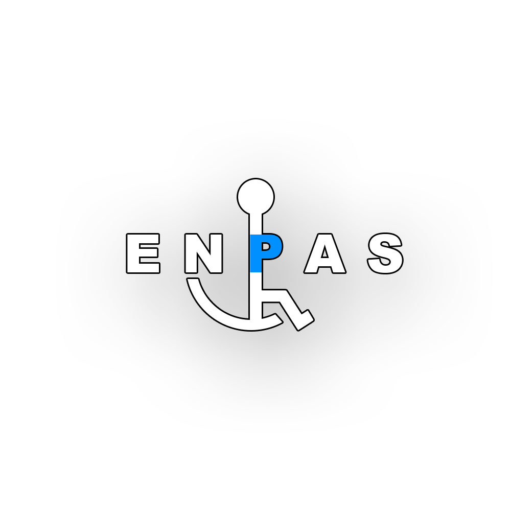

 

  

<h3 align="center">ENPAS</h3>

  

    Engelsiz Park Sistemleri
     
    <a href="https://github.com/Metrohan/ENPAS"><strong>Dosyaları incele »</strong></a>
     
     
  

## 📌 Proje Hakkında

![product-screenshot]

Engelli bireyler için otoparklarda yer alan park alanlarının daha etkili
korunması ve yetkisiz kullanımların engellenmesi amacıyla bir bariyer kontrol
sistemi geliştirilecektir. Sistem, bir mobil uygulama aracılığıyla bariyerlerin
yükseltilip alçaltılmasını sağlayacak, sadece doğrulanmış engelli bireyler
tarafından kullanılabilecektir.

## 🛠 Kullanılan Teknolojiler

* [![Kotlin][Kotlin]][Kotlin-url]
* [![Android Studio][Android Studio]][AndroidStudio-url]
* [![MySQL][MySQL]][MySQL-url]
* ![ESP32][ESP32]

(<a href="#readme-top">başa dön</a>)

## 🚀 Özellikler
- 📱 **Mobil Uygulama:** Kullanıcı dostu arayüz sayesinde park alanlarını görüntüleme ve kontrol etme.
- 🔐 **Yetkilendirme Sistemi:** Engelli bireylerin doğrulanmış hesaplarla park alanlarını kullanabilmesi.
- 🔄 **Otomatik Bariyer Kontrolü:** Sinyal ile hareket eden bariyerler sayesinde güvenli park erişimi.
- 📊 **Gerçek Zamanlı Veri Takibi:** Kullanıcılar dolu/boş park alanlarını anlık olarak görüntüleyebilir.
- ☁️ **Bulut Entegrasyonu:** Güvenli hosting ve API ile veri güvenliği ve senkronizasyonu sağlanır.

(<a href="#readme-top">başa dön</a>)

## 📅 Yol Haritası (Roadmap)
- ✅ **Hazırlık Aşaması** - Proje kapsamının belirlenmesi
- ✅ **Teknoloji Seçimi ve Araştırma** - Kullanılacak donanım ve yazılım teknolojilerinin seçilmesi
- 🔄 **Prototip Geliştirme** - İlk sürümün oluşturulması
- 🔄 **Test ve İyileştirme** - Kullanıcı geri bildirimleri ile sistemin optimize edilmesi
- ⏳ **Lansman ve Yayınlama** - Uygulamanın dağıtılması ve sahada test edilmesi
  
(<a href="#readme-top">başa dön</a>)

---

## 📩 İletişim
Daha fazla bilgi almak veya katkıda bulunmak için bizimle iletişime geçin:

📧 **E-posta:** enpas@enpas.tech

## 📜 Lisans
Bu proje **MPL 2.0 Lisansı** altında lisanslanmıştır. Daha fazla bilgi için [LICENSE](LICENSE) dosyasına göz atabilirsiniz.

## 👥 Katkıda Bulunanlar
| İsim | Rol | İletişim |
|------|-----|----------|
| Metehan Günen | Ekip Lideri, Donanım Sorumlusu, Backend | metehangnn@outlook.com [![LinkedIn: Metehan Günen][linkedin-shield-meto]][linkedin-url-meto] |
| Emre Kaygusuz | Ekip Lider Yardımcısı, Backend | emrekaygusuzcf@gmail.com [![LinkedIn: Emre Kaygusuz][linkedin-shield-emre]][linkedin-url-emre] |
| Semih Çelenk | Menajer, Donanım Sorumlusu, Fullstack | semihcelenkiletisim@gmail.com [![LinkedIn: Semih Çelenk][linkedin-shield-semih]][linkedin-url-semih] |
| Ali Karaca | Backend | alikrc752@gmail.com [![LinkedIn: Ali Karaca][linkedin-shield-ali]][linkedin-url-ali] |
| Musa Emre Delen | Frontend | musaemre22@gmail.com |

(<a href="#readme-top">başa dön</a>)

[contributors-shield]: https://img.shields.io/github/contributors/Metrohan/ENPAS.svg?style=for-the-badge
[contributors-url]: https://github.com/Metrohan/ENPAS/graphs/contributors
[forks-shield]: https://img.shields.io/github/forks/Metrohan/ENPAS.svg?style=for-the-badge
[forks-url]: https://github.com/Metrohan/ENPAS/network/members
[stars-shield]: https://img.shields.io/github/stars/Metrohan/ENPAS.svg?style=for-the-badge
[stars-url]: https://github.com/Metrohan/ENPAS/stargazers
[issues-shield]: https://img.shields.io/github/issues/Metrohan/ENPAS.svg?style=for-the-badge
[issues-url]: https://github.com/Metrohan/ENPAS/issues
[license-shield]: https://img.shields.io/github/license/Metrohan/ENPAS.svg?style=for-the-badge
[license-url]: https://github.com/Metrohan/ENPAS/blob/main/LICENSE.txt
[linkedin-shield-meto]: https://img.shields.io/badge/-LinkedIn:MetehanGunen-black.svg?style=for-the-badge&logo=linkedin&colorB=555
[linkedin-shield-semih]: https://img.shields.io/badge/-LinkedIn:SemihCelenk-black.svg?style=for-the-badge&logo=linkedin&colorB=555
[linkedin-shield-emre]: https://img.shields.io/badge/-LinkedIn:EmreKaygusuz-black.svg?style=for-the-badge&logo=linkedin&colorB=555
[linkedin-shield-ali]: https://img.shields.io/badge/-LinkedIn:AliKaraca-black.svg?style=for-the-badge&logo=linkedin&colorB=555
[linkedin-url-meto]: https://www.linkedin.com/in/metehangunen/
[linkedin-url-semih]: https://www.linkedin.com/in/semih-celenk/
[linkedin-url-emre]: https://www.linkedin.com/in/emre-kaygusuz-56b014250/
[linkedin-url-ali]: https://www.linkedin.com/in/ali-karaca-a0a950298/
[product-screenshot]: images/mockup.png
[Kotlin]: https://img.shields.io/badge/Kotlin-000000?style=for-the-badge&logo=kotlin&logoColor=green
[Kotlin-url]: https://kotlinlang.org/
[Android Studio]: https://img.shields.io/badge/androidstudio-20232A?style=for-the-badge&logo=androidstudio&logoColor=61DAFB
[AndroidStudio-url]: https://developer.android.com/studio?hl=en
[MySQL]: https://img.shields.io/badge/mysql-35495E?style=for-the-badge&logo=mysql&logoColor=blue
[MySQL-url]: https://www.mysql.com/
[Node.js]: https://img.shields.io/badge/NodeJs-96C241?style=for-the-badge&logo=Node&logoColor=green
[Nodejs-url]: https://nodejs.org/en
[ESP32]: https://img.shields.io/badge/esp32-DD0031?style=for-the-badge&logo=esp32&logoColor=white
